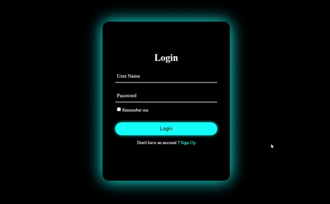

<div align="center">
  <h1>🔐 Animated Login & Signup Form</h1>
</div>

<div align="center">
  
</div>

## 📖 Project Overview

This project is a **modern, neon-themed login and signup form** designed for web applications.  
It demonstrates smooth form transitions, floating labels, and glowing effects without using any frameworks or libraries.  
The purpose of this project is to provide a visually appealing and interactive form that can be integrated into websites or learning projects.

The form includes:

- **Login Form:** Allows users to enter username and password.
- **Signup Form:** Collects username, email, and password with an agreement checkbox.
- Smooth **animated transition** between login and signup forms using only CSS and JavaScript.
- **Floating labels** that move up when the input is focused or filled.
- Neon glow and subtle **hue rotation** effect when hovering over the card.

---

## 🛠 Tech Stack

- **HTML5** – semantic structure of forms
- **CSS3** – animations, transitions, neon glowing effects
- **JavaScript (Vanilla)** – toggling between login and signup

---

## ✨ Features

- 🔄 Seamless switch between **Login** and **Sign Up**
- 🖊 Floating labels on focus/valid input
- 💡 Neon glow + animated hue rotation
- 📱 Responsive, centered card layout

---

## 🚀 Getting Started

Clone the repository:

```bash
git clone https://github.com/<your-username>/animated-login-form.git
cd animated-login-form
```

Open the project in your browser:

```bash
# Simply open index.html
```

Optional: Run a local server (recommended):

```bash
npx serve
```

---

## 📄 License

This project is licensed under the **MIT License**.  
You are free to use, modify, and share with attribution.

---

⭐ If you like this project, don’t forget to **star** the repo!
